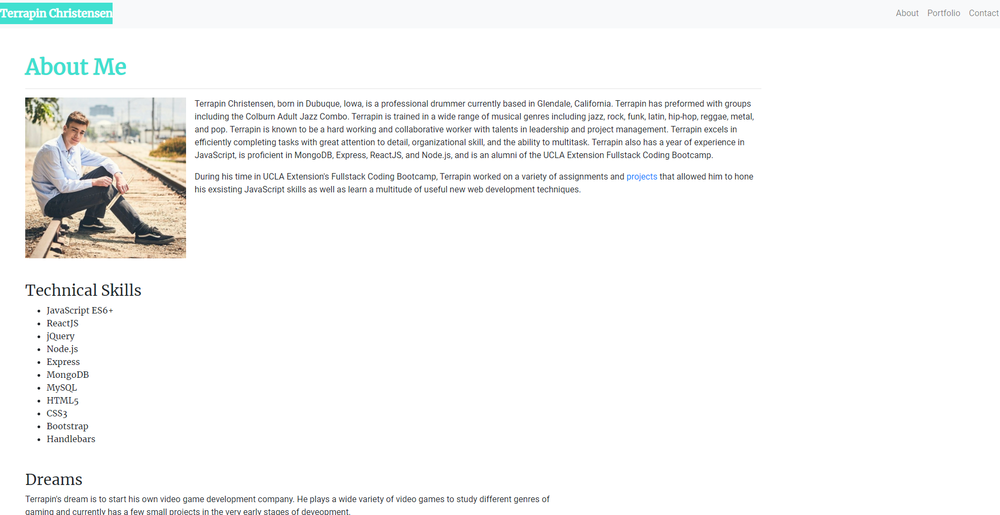
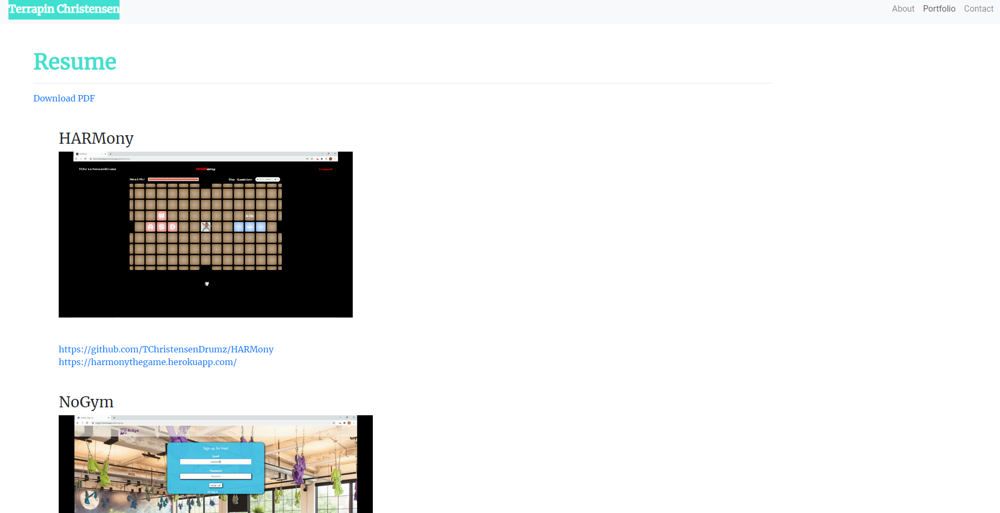
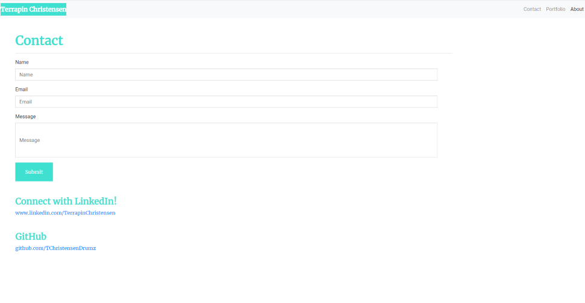

# Portfolio
This is a Portfolio/About Me site built using a Bootstrap CSS Framework to create a responsive design for both mobile and desktop. This project features a navbar to navigate through multiple web pages, responsive layouts and images, and most importantly, the utilization of the Bootstrap grid system.

## Navbar
* Navbar is featured and consistent on all pages.
* Working links navigate user to respective pages.

## All Pages
All pages feature a responsive Bootstrap grid system which adjust row and column size depending on the device's size. While rows and columns will usually take up 2/3rds of the page, extra small devices will have the rows and columns span the entire width of the screen. All pages also feature a sticky footer for aestetic purposes. Semantic html has been added to identify navs, articles, and footers. The footer includes contact info for those who wish to reach me.

### Index

The index (About) page features the bio with a responsive profile picture and sub rows with sub columns to neatly seperate specific artciles within the bio. Lorem ipsum text is currently supplemented between developed parts of the bio to simulate the desired page size of the finished product. This text will eventually be replaced with new sections and information about myself.

#### Key Points
* Responsive profile picture with responsive wrapping text.
* Sub-rows and sub-columns to seperate important articles within the main bio.

### Portfolio

The portfolio page features responsive pictures of my best projects that scale and format depending on the size of the device. Additionaly, there is a link to a downloadable version of my most recent resume. This page will be updated with new pictures with each noteworthy project.

#### Key Points
* Responsive images that format according to device size.
* Link to a downloadable pdf of my resume

### Contact

The contact page features a contact form that will allow users to get in touch with me by submitting their name, email, and an optional message. **This form is currently not functional**. However, once I obtain the required backend knowledge to program a working submission form, I will make the form functional. A filler div class was also added to push the sticky footer to the bottom and stick, since the lack of content was causing the footer to bug and stick to the bottommost element.

#### Key Points
* A form submission to get in contact with me. **(Not Functional)**
* Filler class for div to resolve footer bugs.
* Link to my LinkedIn profile.
* Link to my GitHub profile.

## Credits
https://getbootstrap.com/
 
https://fonts.google.com/

## Link
https://terrapinchristensen.herokuapp.com/
